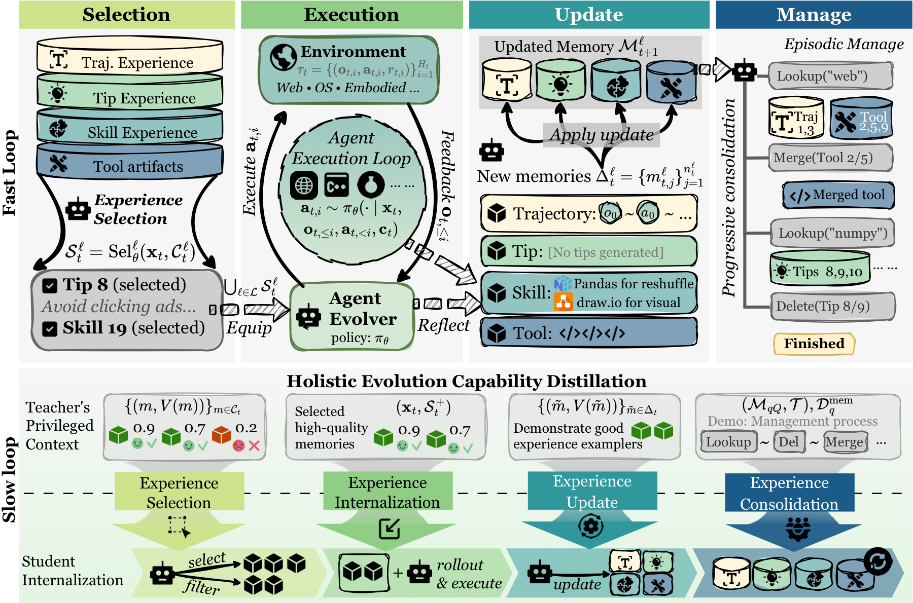

<div align="center">

# OPD-Evolver

### Cultivating a Holistic Agent Evolver via On-Policy Distillation

<p>
  <a href="https://www.python.org"></a>
  <a href="https://docs.astral.sh/uv/"></a>
  <a href="https://huggingface.co/greeky/OPDEvolver"></a>
  <a href="#citation"></a>
</p>

</div>

OPD-Evolver is a **slow–fast co-evolution** framework that trains agents not only to
*store* experience, but to **select**, **use**, **write**, and **maintain** it. It
couples a four-level memory hierarchy for fast, test-time evolution with **on-policy
self-distillation** for slow policy improvement. Across multi-domain benchmarks,
OPD-Evolver improves over memory-only and training-based baselines while internalizing
high-value experience and memory-management behavior directly into the deployable policy.

<div align="center">
  
  <br>
  <em>
    OPD-Evolver framework
  </em>
</div>

## Highlights

- **Four experience capabilities in one policy** — selection, use, writing, and
  maintenance of experience are all learned, rather than hand-coded around a frozen model.
- **Slow–fast co-evolution** — a four-level memory hierarchy drives fast test-time
  adaptation; on-policy distillation slowly folds that behavior back into the policy.
- **Holistic capability distillation** — a privileged teacher supervises experience
  selection, internalization, update, and consolidation for the student.
- **Multi-domain evaluation** — interactive and reasoning benchmarks spanning memory,
  formal reasoning, code/SQL, and lifelong agent tasks.

## What's in this repository

- rollout runners for interactive and reasoning benchmarks (MemoryArena, AMA-Bench,
  InterCode, LifelongAgentBench);
- hierarchical memory collection, retrieval, scoring, and dataset construction;
- script-first training entrypoints for executor OPD fine-tuning *(demonstration path,
  see [Training](#training))*;
- benchmark inference scripts for base models and LoRA-adapted models.

## Installation

This repository uses git submodules. If you cloned without `--recursive` and the
submodule folders are empty, initialize them with:

```bash
git submodule update --init --recursive
```

Use Python 3.12. The project is managed with [`uv`](https://github.com/astral-sh/uv).

```bash
uv venv --python 3.12 --seed --managed-python
uv pip install -r requirements.txt --index-strategy unsafe-best-match
```

For training and local inference, make sure your environment also has the CUDA, vLLM, and
Accelerate stack expected by your machine. The training launchers use `accelerate`,
optional colocated vLLM, and bfloat16 by default.

## Models

The released OPD-Evolver checkpoint / LoRA adapter is hosted on Hugging Face:

> 🤗 **[greeky/OPDEvolver](https://huggingface.co/greeky/OPDEvolver)**

The base policy used throughout the examples is a Qwen3.5-9B model
(`qwen/qwen3.5-9b`); OPD adapters are loaded on top of it via vLLM.

## Training

> [!NOTE]
> **This is a demonstration of the executor OPD training path, not the complete
> training pipeline.** It shows the AWM-based data preparation and a single executor
> fine-tuning launcher so the workflow is reproducible end-to-end on a small scale. The
> full slow–fast co-evolution training stack (selector / reflection components and the
> complete schedule) is not included here. To use the released model directly, see
> [Models](#models).

### 1. Collect AWM rollouts and memory data

```bash
uv run python scripts/eval/bench_simple_awm.py \
  --memory \
  --writer-dataset \
  --selector-dataset \
  --memory-group-size 100 \
  --output-dir workspace/awm_runs_scale_3000_memory \
  --memory-storage-dir workspace/memory/awm_scale_3000
```

This writes rollout summaries and trajectories under
`workspace/awm_runs_scale_3000_memory`, and grouped memory data under
`workspace/memory/awm_scale_3000`.

### 2. Score and merge grouped memory datasets

```bash
uv run python scripts/dataset/score_awm_memory_groups.py \
  --manifest workspace/memory/awm_scale_3000/memory_groups.json
```

The merged scored files are written back to the memory directory, including:

- `workspace/memory/awm_scale_3000/memory_writer_dataset_scored.jsonl`
- `workspace/memory/awm_scale_3000/memory_selector_dataset_scored.jsonl`

### 3. Build executor OPD training data

```bash
uv run python scripts/dataset/build_awm_executor_opd_dataset.py \
  --summary-csv workspace/awm_runs_scale_3000_memory/summary.csv \
  --trajectories-dir workspace/awm_runs_scale_3000_memory/trajectories \
  --output workspace/awm_runs_scale_3000_memory/executor_opd_tasks.jsonl
```

The resulting JSONL is the default AWM executor training dataset used by the launcher.

### 4. Launch executor OPD fine-tuning

```bash
DATASET_PATH=workspace/awm_runs_scale_3000_memory/executor_opd_tasks.jsonl \
MEMORY_DIR=workspace/memory/awm_scale_3000 \
OUTPUT_DIR=outputs/opsd_awm/executor \
bash scripts/train/opsd_mem/launch_opsd_awm.sh
```

Useful environment variables:

| Variable | Description |
| --- | --- |
| `CUDA_VISIBLE_DEVICES` | GPUs used by Accelerate and colocated vLLM. |
| `EPOCHS`, `LR`, `BS`, `GA` | Training schedule and effective batch size. |
| `USE_VLLM` | Set to `false` to disable colocated vLLM. |
| `MAX_TRAIN_SAMPLES` | Limit the number of training examples for smoke tests. |

To inspect the resolved training command without launching training:

```bash
DRY_RUN=1 bash scripts/train/opsd_mem/launch_opsd_awm.sh
```

## Benchmark Inference

The evaluation scripts can run a base model directly or start a local vLLM server with
LoRA adapters. The examples below use script-level defaults where possible; adjust model
paths, ports, task ranges, and output directories for your machine. Replace the adapter
path `outputs/opsd_awm/executor/adapter` with the [released adapter](#models) to reproduce
the reported numbers.

### MemoryArena

Base policy:

```bash
uv run python scripts/eval/bench_simple_memoryarena.py \
  --model qwen/qwen3.5-9b \
  --data-root data/MemoryArena \
  --output-dir workspace/eval/memoryarena/base
```

OPD adapter with local vLLM:

```bash
uv run python scripts/eval/bench_simple_memoryarena.py \
  --model qwen/qwen3.5-9b \
  --data-root data/MemoryArena \
  --vllm \
  --vllm-task-lora-module opd_executor=outputs/opsd_awm/executor/adapter \
  --output-dir workspace/eval/memoryarena/opd_executor
```

### AMA-Bench

Base policy:

```bash
uv run python scripts/eval/bench_simple_ama.py \
  --model qwen/qwen3.5-9b \
  --subset openend \
  --output-dir workspace/eval/ama/base
```

OPD adapter with local vLLM:

```bash
uv run python scripts/eval/bench_simple_ama.py \
  --model qwen/qwen3.5-9b \
  --subset openend \
  --vllm \
  --vllm-task-lora-module opd_executor=outputs/opsd_awm/executor/adapter \
  --output-dir workspace/eval/ama/opd_executor
```

### InterCode

The SQL environment is used here.

Base policy:

```bash
uv run python scripts/eval/bench_simple_intercode.py \
  --env sql \
  --model qwen/qwen3.5-9b \
  --max-tasks 20 \
  --output-dir workspace/eval/intercode_sql/base
```

OPD adapter with local vLLM:

```bash
uv run python scripts/eval/bench_simple_intercode.py \
  --env sql \
  --model qwen/qwen3.5-9b \
  --vllm \
  --vllm-task-lora-module opd_executor=outputs/opsd_awm/executor/adapter \
  --max-tasks 20 \
  --output-dir workspace/eval/intercode_sql/opd_executor
```

### LifelongAgentBench

Base policy:

```bash
uv run python scripts/eval/bench_simple_lifelong.py \
  --task-types os \
  --split test \
  --model qwen/qwen3.5-9b \
  --max-tasks 20 \
  --output-dir workspace/eval/lifelong/base
```

OPD adapter with local vLLM:

```bash
uv run python scripts/eval/bench_simple_lifelong.py \
  --task-types os \
  --split test \
  --model qwen/qwen3.5-9b \
  --vllm \
  --vllm-task-lora-module opd_executor=outputs/opsd_awm/executor/adapter \
  --max-tasks 20 \
  --output-dir workspace/eval/lifelong/opd_executor
```

## Outputs

Most rollout and evaluation commands write:

- `summary.csv` — one row per task with success, reward, steps, cost, and errors;
- `trajectories/` — JSON trajectories with observations, actions, rewards, and raw model
  responses;
- memory stores — hierarchical memory files and optional writer / selector datasets;
- adapter checkpoints — LoRA adapters under the configured training output directory.

## Acknowledgements

This codebase builds on ideas and environments from MemoryArena, AMA-Bench, InterCode,
LifelongAgentBench / OpenEnv, and related work on memory-augmented interactive agents. We
thank the authors of these projects for releasing their code and data.

## Citation

If you find this repository or paper useful, please kindly cite the corresponding paper or project release.

```bibtex
@misc{zhang2026opdevolvercultivatingholisticagent,
      title={OPD-Evolver: Cultivating Holistic Agent Evolver via On-Policy Distillation}, 
      author={Guibin Zhang and Xun Xu and Yanwei Yue and Zikun Su and Wangchunshu Zhou and Xiaobin Hu and Shuicheng Yan},
      year={2026},
      eprint={2606.17628},
      archivePrefix={arXiv},
      primaryClass={cs.CL},
      url={https://arxiv.org/abs/2606.17628}, 
}
```
